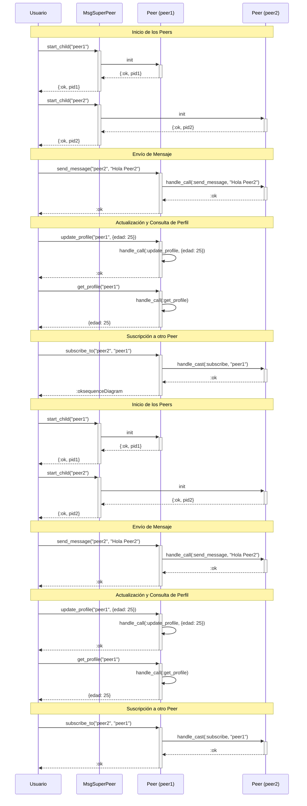

# Diagramas de secuencia de los casos de uso:

```mermaid
sequenceDiagram
    participant Usuario as Usuario
    participant SuperPeer as MsgSuperPeer
    participant Peer1 as Peer (peer1)
    participant Peer2 as Peer (peer2)

    Note over Usuario, Peer2: Inicio de los Peers
    Usuario->>+SuperPeer: start_child("peer1")
    SuperPeer->>+Peer1: init
    Peer1-->>-SuperPeer: {:ok, pid1}
    SuperPeer-->>-Usuario: {:ok, pid1}

    Usuario->>+SuperPeer: start_child("peer2")
    SuperPeer->>+Peer2: init
    Peer2-->>-SuperPeer: {:ok, pid2}
    SuperPeer-->>-Usuario: {:ok, pid2}

    Note over Usuario, Peer2: Envío de Mensaje
    Usuario->>+Peer1: send_message("peer2", "Hola Peer2")
    Peer1->>+Peer2: handle_call(:send_message, "Hola Peer2")
    Peer2-->>-Peer1: :ok
    Peer1-->>-Usuario: :ok

    Note over Usuario, Peer2: Actualización y Consulta de Perfil
    Usuario->>+Peer1: update_profile("peer1", {edad: 25})
    Peer1->>Peer1: handle_call(:update_profile, {edad: 25})
    Peer1-->>-Usuario: :ok

    Usuario->>+Peer1: get_profile("peer1")
    Peer1->>Peer1: handle_call(:get_profile)
    Peer1-->>-Usuario: {edad: 25}

    Note over Usuario, Peer2: Suscripción a otro Peer
    Usuario->>+Peer1: subscribe_to("peer2", "peer1")
    Peer1->>+Peer2: handle_cast(:subscribe, "peer1")
    Peer2-->>-Peer1: :ok
    Peer1-->>-Usuario: :oksequenceDiagram
    participant Usuario as Usuario
    participant SuperPeer as MsgSuperPeer
    participant Peer1 as Peer (peer1)
    participant Peer2 as Peer (peer2)

    Note over Usuario, Peer2: Inicio de los Peers
    Usuario->>+SuperPeer: start_child("peer1")
    SuperPeer->>+Peer1: init
    Peer1-->>-SuperPeer: {:ok, pid1}
    SuperPeer-->>-Usuario: {:ok, pid1}

    Usuario->>+SuperPeer: start_child("peer2")
    SuperPeer->>+Peer2: init
    Peer2-->>-SuperPeer: {:ok, pid2}
    SuperPeer-->>-Usuario: {:ok, pid2}

    Note over Usuario, Peer2: Envío de Mensaje
    Usuario->>+Peer1: send_message("peer2", "Hola Peer2")
    Peer1->>+Peer2: handle_call(:send_message, "Hola Peer2")
    Peer2-->>-Peer1: :ok
    Peer1-->>-Usuario: :ok

    Note over Usuario, Peer2: Actualización y Consulta de Perfil
    Usuario->>+Peer1: update_profile("peer1", {edad: 25})
    Peer1->>Peer1: handle_call(:update_profile, {edad: 25})
    Peer1-->>-Usuario: :ok

    Usuario->>+Peer1: get_profile("peer1")
    Peer1->>Peer1: handle_call(:get_profile)
    Peer1-->>-Usuario: {edad: 25}

    Note over Usuario, Peer2: Suscripción a otro Peer
    Usuario->>+Peer1: subscribe_to("peer2", "peer1")
    Peer1->>+Peer2: handle_cast(:subscribe, "peer1")
    Peer2-->>-Peer1: :ok
    Peer1-->>-Usuario: :ok
```